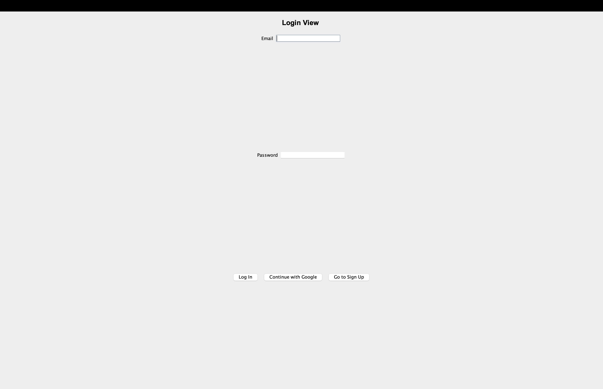
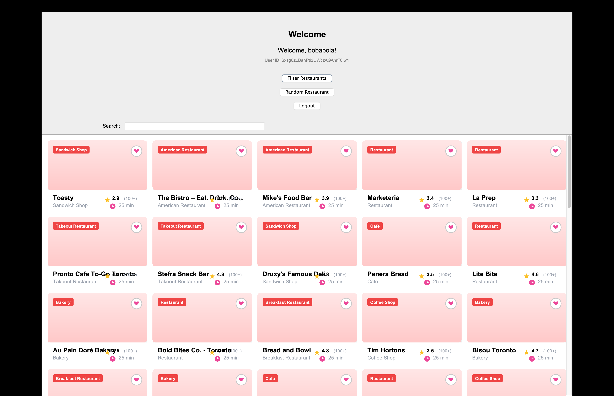
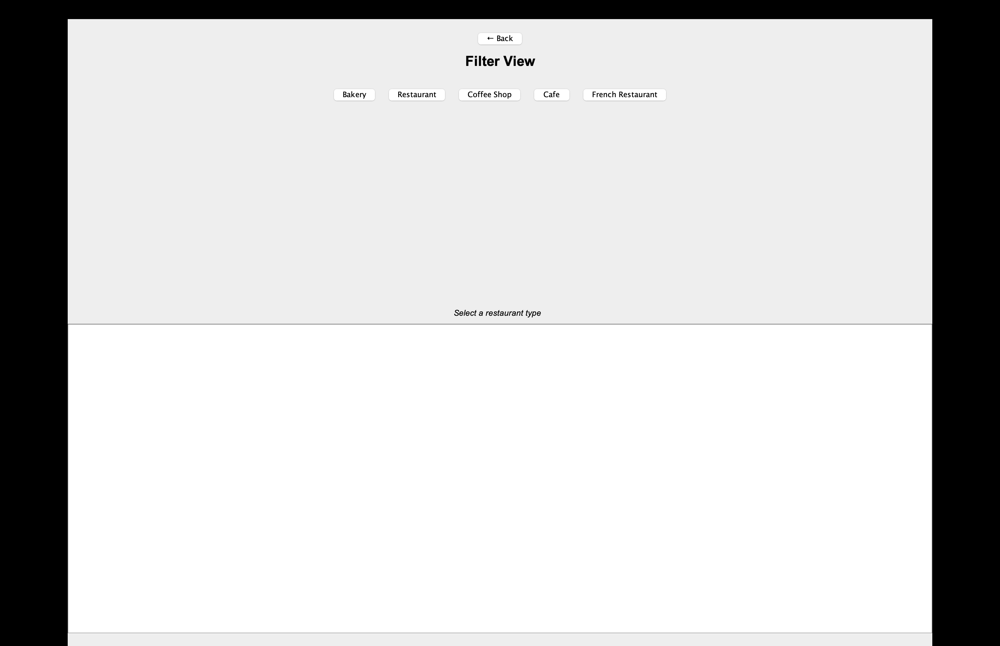
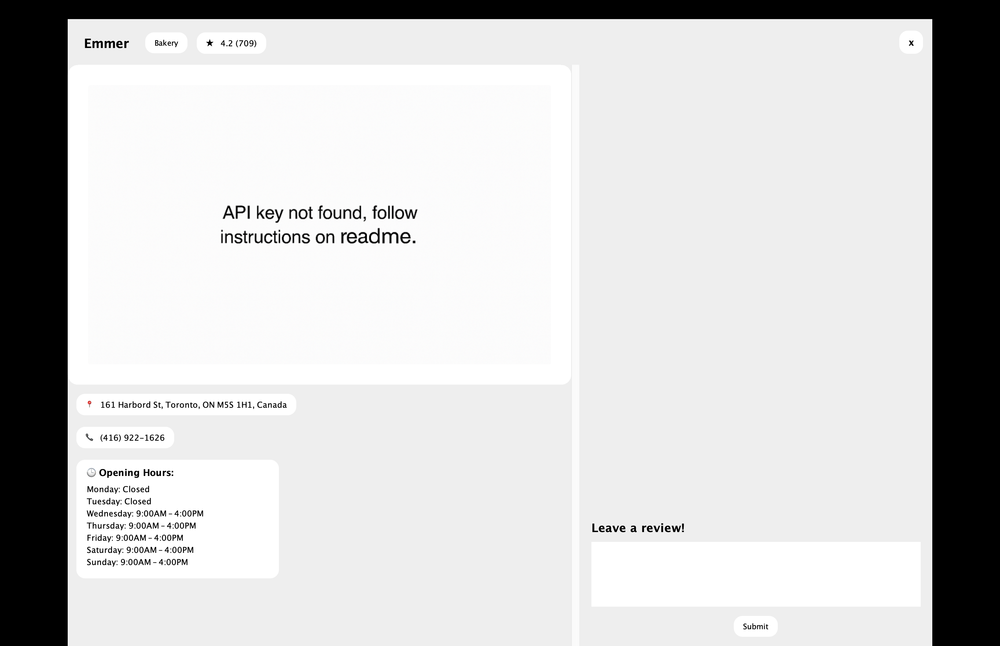

# Team Project
## Summary
Welcome to UofT-Eats, a restaurant review guide catered to University of Toronto Students. Users can create accounts 
through Google, browse different restaurants around campus, quickly filter for what they are feeling, review other 
restaurants, and create a personal list of favourites. Our program also offers accessibility options such as translation 
for students less familiar with English so they can still enjoy the app.
## DeepL API setup

Our translation feature uses the [DeepL API](https://www.deepl.com/pro-api).  
To enable it, you need a DeepL API key and must expose it as an environment variable called `DEEPL_API_KEY`.

### 1. Obtain a DeepL API key

1. Go to the DeepL website: https://www.deepl.com/pro
2. Create an account (or log in if you already have one).
3. Choose "Get started for free", there will be a free api plan.
4. After signing up, open your **Account** / **API** section.
5. Copy your **Authentication Key** (“API key” or “auth key”).  
   It will look like a long string of letters and numbers.

### 2. Set the `DEEPL_API_KEY` environment variable

Set the environment variable so the application can read it at runtime.

#### On Windows (PowerShell)

```powershell
# Set for the current terminal session
$env:DEEPL_API_KEY = "your-deepl-auth-key-here"
```

#### On MacOS / Linux (Terminal)

1. Open your terminal.
2. Add this line to `~/.bashrc` or `~/.zshrc`:

   ```bash
   export DEEPL_API_KEY="your-deepl-auth-key-here"

###3 OpenAI API setup

Our AI recommendation feature uses the OpenAI Chat Completions API
.
To enable it, you need an OpenAI API key and must expose it as an environment variable called OPENAI_API_KEY.

1. Obtain an OpenAI API key

Go to the OpenAI website: [(https://platform.openai.com/api-keys)]

Sign up or log in with your OpenAI account.

On the left sidebar, open API keys (under "User" or "Organization").

Click Create new secret key.

Copy your API key.
It will look like a long string beginning with sk-.

2. Set the OPENAI_API_KEY environment variable

OPENAI_API_KEY="your-openai-key-here"(sometimes the free api key wont work)

<br>
<br>

## Firebase Admin SDK Setup

In order for the register/login flows to work when running the program locally on an IDE (such as IntelliJ), 
we require an additional file containing the Firebase service account key relating to the Firebase Project we set up online.
This service account key corresponds to the Google account you use to join our Firebase Project, so whoever
wants to run our app will likely need their own unique copy. We kindly invite interested parties to provide us
with a gmail address they don't mind sharing so that we may add them to our Firebase Project.

Once you are added to the Firebase Project, follow these steps to obtain and configure your Firebase service account key:

1. Go to the **Firebase Console**  
   https://console.firebase.google.com/

2. Select your project: **uoft-eats-bd368**

3. Click the **⚙️ (Settings icon)** next to *Project Overview*  
   → Choose **Project settings**

4. Navigate to the **Service accounts** tab

5. Under **Firebase Admin SDK**, make sure the language is set to **Java**

6. Click **Generate new private key**

7. Confirm by clicking **Generate key** in the popup

8. A JSON file will download automatically  
   Rename this file to:  
   **`service-account-key.json`**

9. Move the JSON file to your project’s **root directory** (same level as .idea, src)

# Google Places API Setup

NOTE: The program will run without the token. However, a missing token will result in images not loading. This is purely for image loading.

This guide explains how to obtain a Google Places API key and configure it as an environment variable in IntelliJ IDEA for your project.

## Prerequisites
* A Google Cloud Platform (GCP) account.
* IntelliJ IDEA installed.

---

## Part 1: Getting a Google Places API Token

1.  **Log in to Google Cloud Console**
    * Go to the [Google Cloud Console](https://console.cloud.google.com/).

2.  **Create or Select a Project**
    * Click the project dropdown at the top of the page.
    * Click **"New Project"** to create a fresh one, or select an existing project.

3.  **Enable the Places API**
    * In the left sidebar, go to **APIs & Services** > **Library**.
    * Search for **"Places API"**.
    * Click on the result (ensure it is the specific "Places API" or "Places API (New)" depending on your library version) and click **Enable**.
    * *Note: You may be prompted to enable billing. A billing account is required to use the Google Maps Platform, even for the free tier.*

4.  **Create Credentials (API Key)**
    * In the left sidebar, go to **APIs & Services** > **Credentials**.
    * Click **+ CREATE CREDENTIALS** at the top and select **API key**.
    * Your new API key will appear in a pop-up window.
    * **Copy this key**; you will need it for the next step.

---

## Part 2: Setting the Environment Variable in IntelliJ

To keep your API key secure, we inject it into the application as an environment variable named `PLACES_API_TOKEN` rather than hardcoding it.

1.  **Open Run Configurations**
    * In IntelliJ, go to the top toolbar.
    * Click the dropdown menu next to the **Run** (▶) and **Debug** (🐞) icons (it usually displays the name of your Main class).
    * Select **Edit Configurations...**

2.  **Select Your Application**
    * In the left sidebar of the "Run/Debug Configurations" window, select your main application configuration (usually listed under **Application**).

3.  **Add the Environment Variable**
    * Locate the field labeled **Environment variables**.
    * Click the small document icon 📄 on the far right of that field.
    * In the new window, click the **+** (plus) button to add a new variable.
    * **Name:** `PLACES_API_TOKEN`
    * **Value:** Paste the API key you copied from the Google Cloud Console.
    * Click **OK** to close the environment variables window.


## User Stories
### Kenshin
As a user, I want to register an account using a username and password or a Google account, so that my 
personal restaurant data is saved securely.

As a user, I want to be able to log in and log out using my Google account or a username and password, so 
that I can log in on different devices and my account remains secure.
### Theo
As a user, I want to browse all the restaurants within a given radius around University of Toronto, so 
that I can find restaurants close to campus.
### Prabeer
As a user, I want to filter restaurants organized in a list based on categories I'm in the mood for that I 
can find what I want quickly.
### Raymond
As a user, I want to be able to add a review to a restaurant so that I can share my opinion on the best 
and worst restaurants around campus.
### Dean
As a user, I want to save my favorite restaurants into a list, so I can access them later.
### Justin
As a user I want to translate any given review into a language I'm more familiar with, so I can interact with the 
diverse student body at UofT.
### Zihao Wang
As a user I hope the app can recommend restaurants based on my preferences.
## APIs
UofT-Eats uses the [Google Places API](https://developers.google.com/maps/documentation/places/web-service/overview) for 
data on the restaurants and the [DeepL API](https://www.deepl.com/pro-api) for help translating the reviews and [Openai API](https://openai.com/api/) for recommendations.
## Screenshots
### Log In

### Main Page

### Filter

### Restaurant

